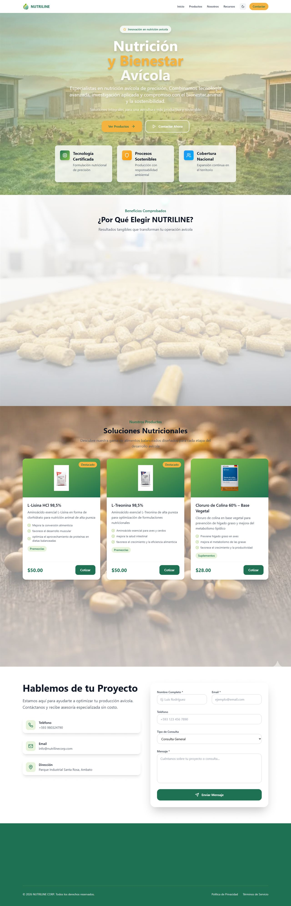

# Nutriline Corp — Case Study

> **Precision poultry-nutrition company** · corporate website + private admin platform.
> 🌐 Live: **https://nutrilinecorp.com** · 📍 Ambato, Ecuador

| | |
|---|---|
| **Role** | Solo full-stack developer (freelance) |
| **Client** | Nutriline Corp — poultry-nutrition & feed-additives manufacturer |
| **Stack** | Next.js 14 · React 18 · Tailwind CSS · Sequelize / MySQL · framer-motion |
| **Status** | Live in production |

---

## The client
Nutriline Corp is an Ecuadorian company specialised in **precision poultry nutrition** — amino acids, choline chloride, monocalcium phosphate, minerals, additives and premixes that help producers optimise broiler and layer performance. They sell B2B to poultry farms and distributors, and needed both a credible storefront and a way to manage their own catalog and leads.

## What the site does
A single Next.js app serving a **public website** and a **private admin panel** from one deployment.

**Public site**
- **Home** — brand hero, featured products, value proposition and GMP certification.
- **Products** — a filterable catalog by category (Amino acids, Minerals, Additives, Premixes…), each item with its own server-rendered detail page (`/products/[slug]`) and technical sheet. Real lines include **Greenphos** (monocalcium phosphate), **plant-based Choline Chloride 60%**, **L-Lysine** and **L-Threonine**.
- **Resources** — a technical library for poultry producers.
- **About / Contact** — company info and a contact funnel that lands leads in the admin inbox.

**Admin panel** (`/admin`) — authenticated dashboard to create/edit products, manage the resources library and read contact messages, so the team updates the catalog without a developer.

## Screenshots

  
  

## Engineering highlights
- **Performance** — rebuilt the homepage as **server-rendered** + a `sharp` image pipeline → mobile **LCP ~17s → ~2.9s**, page weight **4.4 MB → ~0.5 MB**.
- **Full-stack** — product/resource/contact data in MySQL via Sequelize, exposed through Next.js route handlers, behind an authenticated admin area.
- **Hardening** — authentication, rate limiting, security headers and input sanitisation, validated by an automated check.
- **SEO/GEO** — SSR content, JSON-LD structured data, dynamic sitemap, Open Graph images and an `llms.txt` so AI assistants can cite the brand.

---

Code is proprietary to Nutriline Corp; this repository documents my work for portfolio purposes. Built by <a href="https://github.com/johnvergel-dev">John Vergel</a>.