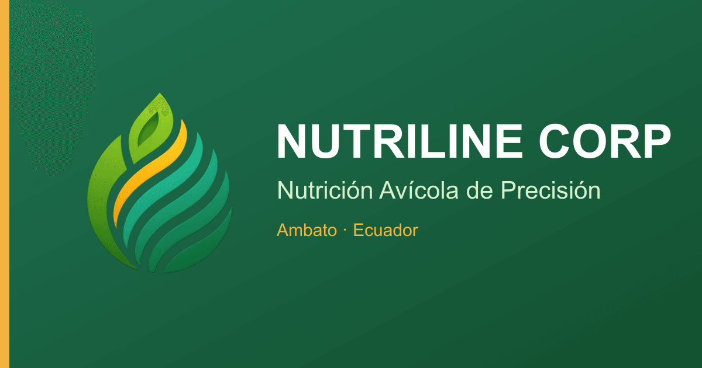
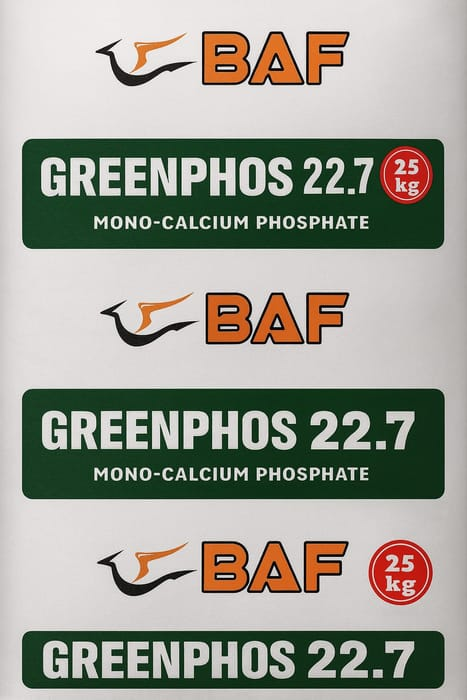

# Case Study — Nutriline Corp

> Full-stack corporate website + admin panel for a precision poultry-nutrition company.
> **Live:** https://nutrilinecorp.com

| | |
|---|---|
| **Role** | Solo full-stack developer (freelance) |
| **Client** | Nutriline Corp — poultry-nutrition manufacturer · Ambato, Ecuador |
| **Stack** | Next.js 14 · React 18 · Tailwind 3 · Sequelize/MySQL · framer-motion |
| **Status** | In production |

---

## Problem
Nutriline needed a fast, credible corporate site **and** a private back-office to manage products, technical resources and contact leads — running on shared hosting, with strong SEO so producers (and AI assistants) could find them.

## What I built
- **Public site** — home, product catalog with per-product SSR pages (`/products/[slug]`), technical resources library, about, and a contact funnel.
- **Admin panel** — authenticated CRUD for products, resources and contacts over MySQL via Sequelize.
- **One consolidated Next.js service** — API route handlers + SSR in a single deployable, engineered to run on shared hosting.

## Results
- LCP **~17s -> ~2.9s** and page weight **4.4 MB -> ~0.5 MB** — homepage SSR, a `sharp` WebP image pipeline, and low-cost animations.
- **Hardened** — authentication, rate limiting, security headers and input sanitization, validated by an automated check in the build.
- **SEO/GEO** — SSR content, structured data (JSON-LD), a dynamic sitemap, OG images, and an `llms.txt` for AI assistants.

## Gallery

---

Code is proprietary to Nutriline Corp — this repository documents my work for portfolio purposes. Built by <a href="https://github.com/johnvergel-dev">John Vergel</a>.