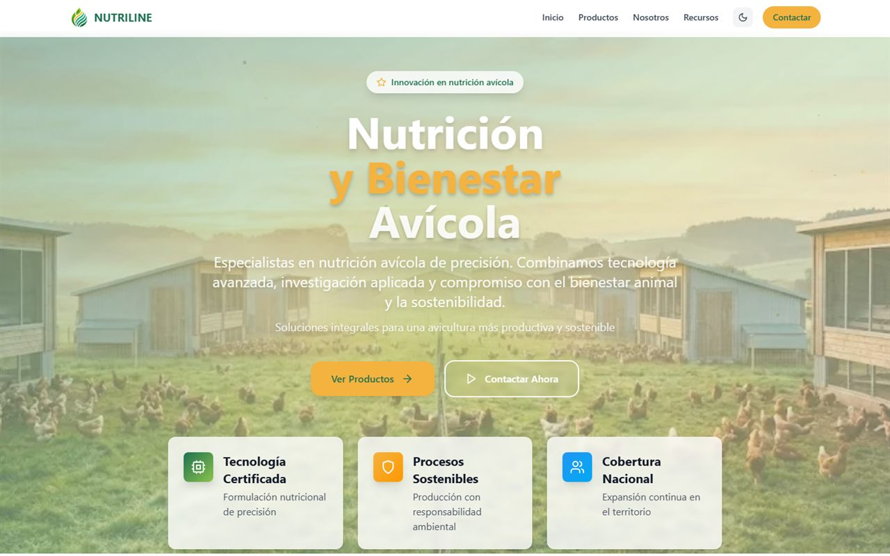
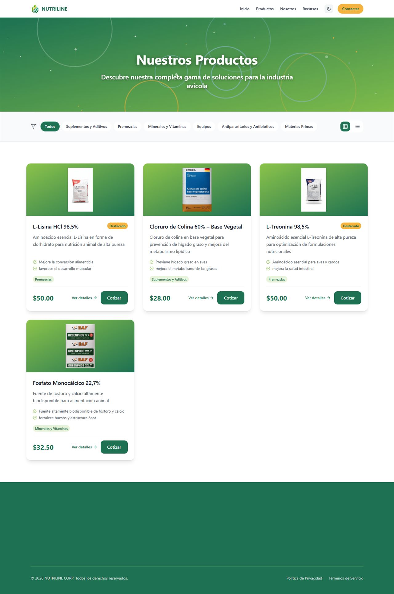
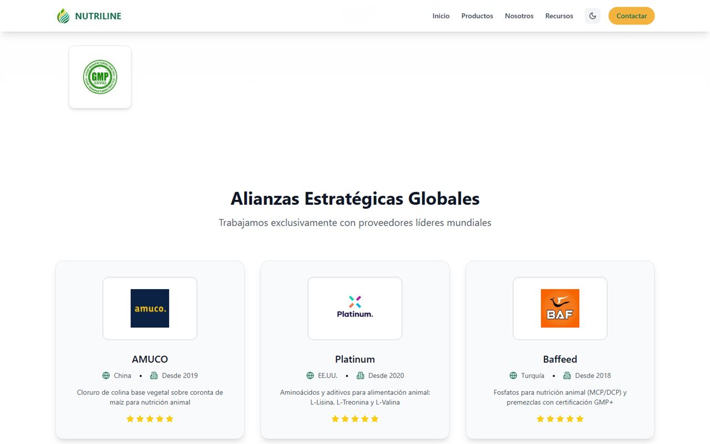
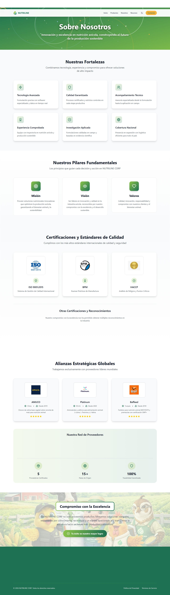
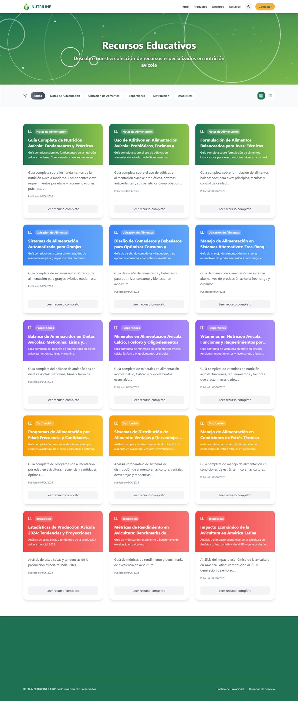
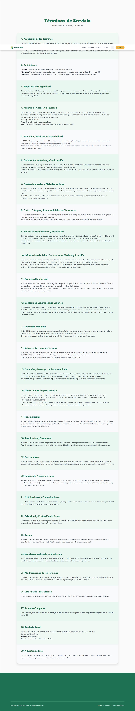

# Nutriline Corp — Case Study

> **Precision poultry-nutrition company** · corporate website + private admin platform, built end-to-end.
> 🌐 **Live:** https://nutrilinecorp.com  ·  📍 Ambato, Ecuador

| | |
|---|---|
| **Role** | Solo full-stack developer (freelance) |
| **Client** | Nutriline Corp — poultry-nutrition & feed-additives manufacturer |
| **Industry** | B2B · animal nutrition / agribusiness |
| **Stack** | Next.js 14 · React 18 · Tailwind CSS · Sequelize / MySQL · framer-motion |
| **Status** | Live in production |

---

## Overview
Nutriline Corp needed to go from no real web presence to a credible, fast, **self-manageable** platform — one site that works as a sales storefront for the public *and* a private back-office for the team. I designed and built it solo: front-end, back-end, database, deployment and SEO.

## The client & the brief
Nutriline Corp is an Ecuadorian manufacturer specialised in **precision poultry nutrition**. Their catalog covers the inputs feed mills and poultry farms use to optimise broiler and layer performance: **amino acids** (L-Lysine, L-Threonine), **choline chloride**, **monocalcium phosphate**, **minerals & vitamins**, **additives** and **custom premixes**.

Their customers are **B2B** — feed producers, distributors and farms — so the site has to build trust with a certified-looking presence, showcase the catalog with real technical detail, rank in search (and be citable by AI assistants), and let the team manage products and leads **without a developer**.

## What the site includes
A single Next.js application serves a **public website** and a **private admin panel** from one deployment: a marketing home, a filterable product catalog with per-product SSR pages, a technical resources library, an about page with the company's certifications and supplier alliances, legal pages, and an authenticated `/admin` dashboard for product / resource / contact management.

## A tour of the site

### 📦 Product catalog
Filterable by category — each product (L-Lysine, Choline Chloride, L-Threonine, Monocalcium Phosphate…) has its own server-rendered detail page with a technical sheet and price.

### 🤝 Strategic suppliers & alliances
World-class partners — **BASF, Cargill, AMUCO** (China), **Platinum** (USA) and **Baffeed** (Turkey) — each shown with origin and partnership history.

### 🏢 About & certifications
Company strengths, mission / vision / values, and quality certifications — **ISO 9001 · GMP · HACCP**.

### 📚 Technical resources
A growing library of educational articles for poultry producers — the site's long-term SEO engine.

### 📄 Terms of service
A complete legal terms & conditions page.

## The challenge
The site runs on **shared hosting** (no Next.js image optimizer, a single Node process via Passenger), and the first version was a client-rendered app behind a ~2.6 s loading screen — so the initial HTML was almost empty, hurting both SEO and perceived speed. It had to become fast and crawlable **without leaving that hosting environment**.

## What I delivered (engineering)
- **Re-architected for SSR** — the homepage and product pages render on the server, so content is in the initial HTML (good for crawlers, AI assistants and LCP).
- **`sharp` image pipeline** — backgrounds converted to WebP, everything recompressed in place.
- **Full-stack data layer** — products, resources and contacts in **MySQL via Sequelize**, exposed through Next.js route handlers, all from one consolidated service (no separate backend).
- **Authenticated admin** with protected routes.
- **Hardening** — authentication, per-IP rate limiting, security headers and input sanitisation, validated by an automated security check.
- **SEO / GEO** — JSON-LD structured data (Organization, WebSite, Product, Breadcrumb), a dynamic sitemap with per-product URLs, Open Graph images, and an `llms.txt` summary so AI assistants can cite the brand.

## Results
| Metric (mobile, production) | Before | After |
|---|---:|---:|
| Largest Contentful Paint | ~17.2 s | **~2.9 s** |
| Total Blocking Time | 3190 ms | **0 ms** |
| Page weight | 4.4 MB | **~0.5 MB** |

Product detail pages (no splash) render even faster (~2.1 s LCP).

---

Code is proprietary to Nutriline Corp; this repository documents my work for portfolio purposes. Built by <a href="https://github.com/johnvergel-dev">John Vergel</a>.